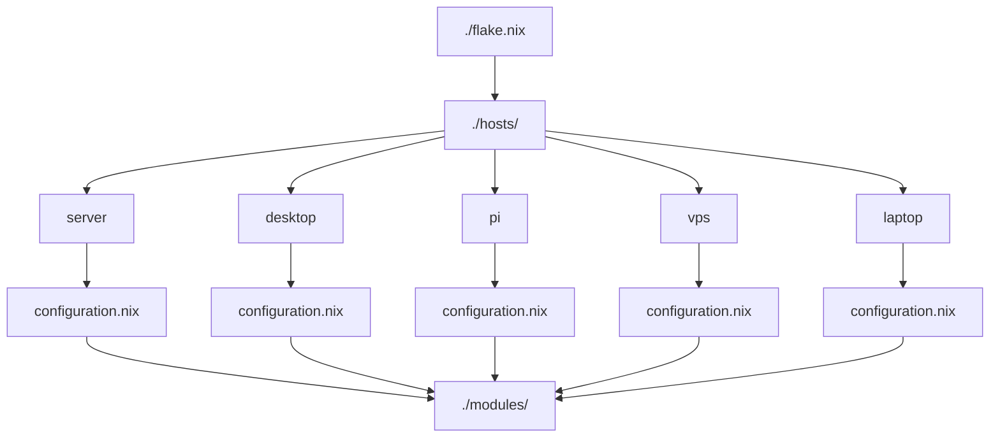

# nix-config
[](https://github.com/zzzealed/nix-config/actions/workflows/check-no-build.yml)
[](https://github.com/zzzealed/nix-config/actions/workflows/build.yml)


## Structure

> [!NOTE]
> NOT exhaustive, but a general overview.

## Usage
1. Clone, or download the repository:
```sh
curl -L -O https://github.com/zzzealed/nix-config/archive/refs/heads/main.tar.gz
```
2. Unzip with:
```sh
tar -xzf main.tar.gz
```
3. Enter shell: 
```sh
cd nix-config-main && nix-shell
```
4. Rebuild and switch with a host's (eg. "desktop-nixos") configuration:
```sh
sudo nixos-rebuild switch --flake .#desktop-nixos
```
> [!IMPORTANT]
> You need to use `nixos-generate-config` and replace `./hosts/foo/hardware-configuration.nix`.

> [!IMPORTANT]
> You also need a valid SSH-key defined in `./secrets/secrets.nix` to decrypt any secrets.

## To-do
- [ ] Init: `services.octodns` blocker: nixos/nixpkgs#517510
- [ ] Init: `services.crowdsec` blocker: nixos/nixpkgs#535319
- [ ] Init: `sops.secrets` blocker: mic92/sops-nix#970
- [ ] Init: `base24-scheme` blocker: nix-community/stylix#252
- [ ] Switch hosts `server`, `pi` to `boot.loader.limine`
- [ ] Make all files+dirs kebab-case
- [ ] Disable password SSH and add agent
- [ ] More `pkgs.navi` docs
- [ ] `services.*`: Unique ports?
- [ ] Just rawdog dnsmasq instead of Pihole
