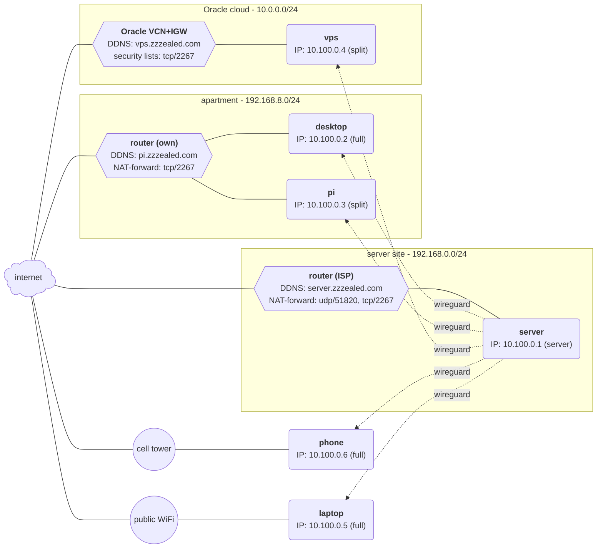

# WireGuard Topology
| Shape | Mermaid syntax | Meaning |
|-------|----------------|---------|
| Rounded rectangle | `( )` | host |
| Hexagon | `{{ }}` | router/firewall |
| Circle | `(( ))` | uncontrolled access |
| Solid edge | `---` | physical link |
| Dashed edge | `-.->` | WireGuard tunnel |

| Keyword | Meaning |
|---------|---------|
| `IP` | WireGuard addresses 10.100.0.0/16 |
| `server` | the WireGuard server/hub every peer connects to |
| `full` | AllowedIPs `0.0.0.0/0` all traffic routed through home |
| `split` | AllowedIPs `10.100.0.0/24` + `192.168.0.0/24` only |

